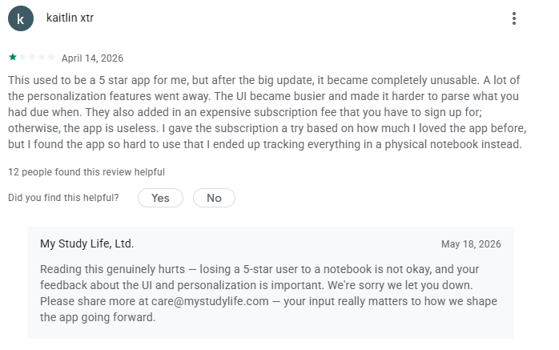
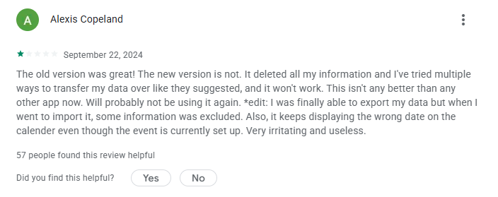
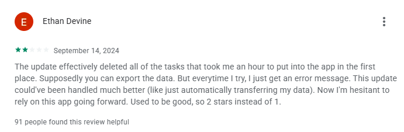
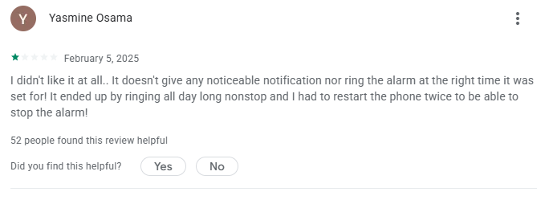
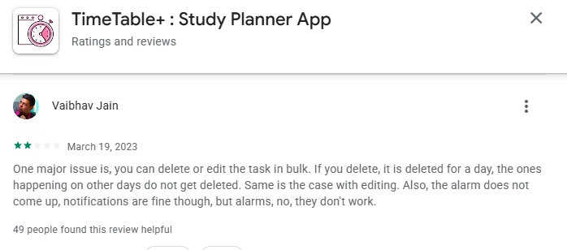
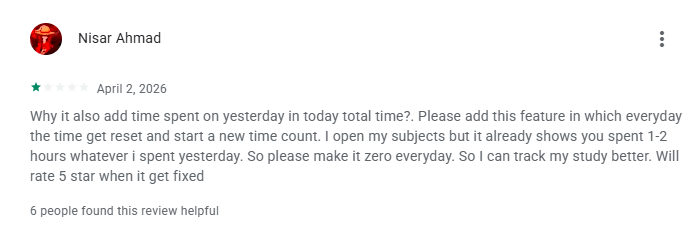

# Assignment 2: From Idea to Launch Ready Product Plan
**Product:** StudyPilot
**Tagline:** An AI-powered study planner for students.

---

## Part 1: Problem Discovery and Validation

### Method 1 — Negative Review Mining (App Store / Play Store, 1–2 star reviews)

I read 1-star and 2-star reviews across three direct competitors to find the recurring whitespace they're leaving open.

**Competitor 1: My Study Life – Study Planner**

- *Kaitlin xtr (1★):* the app used to be a 5-star experience, but a redesign made the UI busier and harder to scan, and a new required subscription made the free version unusable. She switched back to a physical notebook. *(12 people found this helpful)*
- *Eni (1★):* after the update, years of class data disappeared, and the new interface is more confusing than the old one. No option to switch back.
- *Stephanee Cooper (1★):* the free tier caps you at 6 tasks, and subject lists don't match university-level courses. Nothing is customizable without paying.
- *Alexis Copeland (1★):* the migration/export tool used to move data to the new version doesn't fully work — some data is excluded on import, and calendar dates display incorrectly. *(57 people found this helpful)*

- *Ethan Devine (2★):* an update wiped an hour of manually entered tasks, and the export function errors out instead of recovering the data. *(91 people found this helpful)*

- *A Google user (2★):* notifications only arrive when connected to Wi-Fi, and even then usually fire after the class has already started. *(71 people found this helpful)*

**Competitor 2: TimeTable+ : Study Planner App**

- *Yasmine Osama (1★):* no reliable notification/alarm at the scheduled time — instead the alarm rang continuously all day and required two phone restarts to stop.
- *Collins law (1★):* no way to duplicate a day's schedule to another day, so a full week had to be built manually (4 hours), and the alarm worked only once and then stopped functioning.
- *Fz Sw (1★):* no option to change the notification tone.
- *Vaibhav Jain (2★):* bulk edit/delete only applies to a single day, not recurring tasks across the week, and alarms consistently don't fire (though notifications do).

- Notably, the developer's own reply to Collins law confirms the root cause: on non-stock Android UIs (Xiaomi, Realme, Oppo), the OS's aggressive battery-saver kills the app in the background — a reliability problem baked into how these apps are built, not a one-off bug.

**Competitor 3: TrackIt – Study Tracker & Timer**
- *Baby:* the app's own time-tracking is so slow/laggy that a plain phone clock timer is more useful.

- *Nisar Ahmad (1★):* daily study time doesn't reset at midnight — yesterday's hours carry into today's total, making it impossible to see a true daily count.

### Method 2 — Community Dwelling (Reddit)

A Reddit thread from a developer who built their own study planner surfaced clearer signal than any single review, because it comes from someone who already lived the problem before building a product:

- **Original poster (developer):** built the app because calendar apps and timers don't talk to each other — they wanted one integrated system instead of three disconnected tools.
- **PhilosophyWise9582:** loves the concept, but says adding a built-in to-do list is the missing piece to make it "super powerful."
- **Preferabledonkey (21-year-old psychology student):** actively using a rough/early version for exam deadlines and study streaks, specifically praising the **week view + smart timer** combination. She liked it enough to offer to produce a promotional video for **$30 (full usage rights)** in exchange for 6 months of premium access — an unprompted, organic willingness-to-promote signal.
- **constantin-r:** wants distinct sound cues for Pomodoro focus vs. break intervals ending, calling it more important than ambient sound options.

### Synthesis: What the demand signal actually says

Across three unrelated apps and one independent community thread, the same five problems repeat:

1. **Notifications/alarms are unreliable** — the single most repeated complaint (My Study Life, TimeTable+, TrackIt all fail here for different technical reasons).
2. **Data loss and broken sync/export** on updates or across devices.
3. **Artificial limits gating basic use** (task caps, no bulk/recurring edits, no schedule duplication) rather than genuinely premium features.
4. **Fragmentation** — students want calendar, timer, and to-do list in one place instead of three separate apps that don't sync (the strongest and most explicit signal, straight from a builder who already tried to solve it).
5. **Inaccurate time tracking logic** (TrackIt's non-resetting daily counter).

### Painkiller or Vitamin?

**Painkiller.** The evidence isn't people saying "this would be nice" — it's people actively abandoning tools that fail them: a 5-star user reverting to a paper notebook, a student manually rebuilding a week-long schedule after losing it to a bug, and a developer building a replacement from scratch rather than tolerating the fragmentation. When the response to a broken tool is "I built my own" or "I went back to pen and paper," that is an active, felt problem — not a vitamin.

---

## Part 2: Product Definition and Tier Classification

**One-paragraph definition:**
StudyPilot is an AI-assisted study planner for students (from high school through university and competitive-exam prep, e.g. UPSC-style long-form study) who are currently stitching together a calendar app, a separate timer, and a to-do list — and losing time and motivation to the friction between them. StudyPilot combines a week-view calendar, a smart Pomodoro-style timer with daily-reset time tracking, and an integrated task list, with AI used specifically to auto-generate a realistic weekly study schedule from a student's deadlines and available hours, and to re-plan automatically when a session is missed. Now is the right time because student-facing planner apps in this space are actively losing trust: recent updates from established competitors (My Study Life, TimeTable+) have broken data migration and notification reliability for existing paying users, creating an open window to win over an already-dissatisfied, already-paying audience rather than having to create demand from zero.

**Tier: Standard**

| Criterion | Standard Tier |
|---|---|
| Build time | 2–6 weeks |
| Pricing model | $29–$99/month |
| Distribution | SEO, X, Cold Email |
| Revenue gate | $1k MRR in 90 days |

**Why Standard, not Micro or Premium:**

| Criterion | Justification |
|---|---|
| Build time | 2–6 weeks fits an MVP with calendar + timer + tasks + one AI scheduling feature, built solo with AI as a co-builder. A Micro-tier 1–7 day build cannot realistically include reliable cross-device sync and AI scheduling; a Premium-tier 1–6 month build is unjustified before any user validation. |
| Pricing model | $29–99/month subscription (research shows students already pay for planners — My Study Life's paying users are the exact audience being targeted for a switch). |
| Revenue gate | $1,000 MRR in 90 days, matching the Standard-tier gate, is a realistic bar for a subscription study tool with a validated, already-frustrated user base. |
| Distribution | SEO, X, and cold email/DM outreach to the communities and Reddit threads already discussing this exact problem — no paid acquisition budget required to start. |

**Design principles (what "good" looks like for this product):** Beyond fixing what's broken, the product should keep what already works well in this category — simplicity over feature bloat (no cluttered UI, no forced ads or in-app-purchase friction blocking core use), and a visual sense of progress (e.g. a simple progress bar/streak indicator) so students can see momentum, not just a task list.

---

## Part 3: Tech Stack Justification

| Layer | Choice | Why |
|---|---|---|
| Frontend | React Native (Expo) | Single codebase for iOS + Android, critical because unreliable notifications/alarms was the #1 complaint across competitors — native push needs a real mobile runtime, not a wrapped web view. |
| Backend / DB / Auth | Supabase (Postgres + built-in Auth) | Managed Postgres removes the exact failure mode that broke My Study Life (data loss/export bugs on migration) by keeping data server-side and versioned, not device-local. Free tier covers 0–1,000 users at effectively $0. |
| Push notifications | OneSignal (or Expo push service) | Directly targets the root cause TimeTable+'s own developer admitted to (OS battery-savers killing local background alarms) by delivering via a remote push service instead of relying on an in-app local timer/alarm surviving in the background. |
| AI scheduling | OpenAI API (function calling for schedule generation/re-planning) | No need to train or host a model; ecosystem maturity means the "generate a weekly plan from deadlines" feature can ship in the MVP window instead of a multi-month research project. |
| Payments | Stripe (subscriptions) or Gumroad | Off-the-shelf recurring billing; matches the class principle that the real moat is distribution, not billing infrastructure. |
| Hosting | Supabase + Expo EAS / app stores | No custom server infrastructure to maintain solo. |

**Evaluated against the five criteria:**
1. **Time to market:** every choice above is a managed service with existing SDKs — no component requires custom infrastructure before v1 ships.
2. **Team size/skill fit:** all maintainable by one person; no DevOps hire needed.
3. **Cost at low scale:** Supabase, Expo, and OneSignal all have free tiers that cover 0–1,000 users; only Stripe/OpenAI usage scales with actual paying revenue.
4. **Ecosystem maturity:** React Native, Supabase, Stripe, and OpenAI all have mature libraries and existing integration guides — no bleeding-edge tooling risk.
5. **Scalability ceiling:** Supabase and Stripe both scale to paid tiers without a rewrite if the product gains real traction.

**What I'm deliberately not building:** no custom billing system (Stripe/Gumroad only), no custom notification/alarm engine (OneSignal instead of local device alarms — directly fixing what TimeTable+ got wrong), and no custom auth system (Supabase Auth). The moat here is solving the fragmentation and reliability problem better than incumbents, not owning infrastructure.

---

## Part 4: Mobile App vs Web App Decision

| Factor | Analysis |
|---|---|
| Distribution channel | App stores fit better than SEO/social here, because the direct competitors (My Study Life, TimeTable+, TrackIt) are all discovered via app store search, not the open web. |
| Hardware/OS access | Reliable local notifications and background timers require native OS-level access — this is precisely the layer where every competitor reviewed above is failing. |
| Usage pattern | Daily, habitual (checking today's schedule, starting a study timer) — the class framework explicitly favors mobile for this pattern over web. |
| Iteration speed | Slower than web due to app store review, but acceptable at Standard-tier timelines; the reliability problem being solved requires native access regardless of the iteration-speed tradeoff. |
| Monetization | Avoiding in-app purchase cuts by routing subscriptions through Stripe web checkout (linked from the app, not processed via app store IAP) keeps the full 15–30% margin that would otherwise be lost to app store fees. |

**Decision: Mobile app (React Native/Expo, iOS + Android).** This is not chosen because a mobile app "feels more impressive" — it is the only option that can fix the specific, repeated failure mode (notifications/alarms dying in the background) that is actively driving 1-star reviews and churn across every competitor studied. A web app would inherit the exact same reliability gap.

---

## Part 5: SDLC Approach

**Model: Agile / iterative**, mapped to the three-phase blueprint:

1. **Discover and Validate** — a one-page discovery memo instead of a formal spec: confirm the target ICP (students already paying for a planner app), lock the tier (Standard), and validate the core wedge (fixing notification reliability + fragmentation) before writing code.
2. **Build and Ship** — MVP with one core feature only: an AI-generated weekly schedule with reliable push-based reminders. Timer and to-do list are the wedge's supporting features, not separate products. AI is used as a co-builder for the scheduling logic and boilerplate.
3. **Launch and Report** — internal bug bash, soft launch to a small warm group (including the Reddit users already interested, e.g. Preferabledonkey), a feedback loop through real user interviews, and a closing retrospective with real numbers.

**Why Waterfall fails here:** Waterfall assumes requirements are fully known upfront and locked before development starts. This product's core insight — that reliability (not more features) is the actual differentiator — only became clear through review mining and a Reddit thread, and further insight will keep surfacing once real users touch the MVP (e.g., which AI scheduling behavior actually feels useful vs. annoying). A Waterfall process has no formal mechanism to fold that feedback back into the plan before "launch," which is exactly the risk this idea can't afford to take.

---

## Part 6: Distribution and Go-to-Market Plan

Applying the **curation → alignment → narrative** framework: build a list of 20–30 micro-influencers/communities (5K–50K audience) who already speak to this exact niche, offer the product for free plus an affiliate cut instead of a flat sponsorship fee, and lead with the founder's own story of building StudyPilot after seeing students get burned by unreliable planner apps.

**Curated list:**

| Creator / Community | Platform | Outreach angle |
|---|---|---|
| Preferabledonkey (Reddit user, psych student) | Reddit | Already an organic advocate who offered to make a promo video for a premium code — the cheapest, most authentic first partnership available; formalize with an affiliate link instead of a flat $30 fee. |
| r/GetStudying | Reddit community | Post a "how I built this after reading your complaints" thread, inviting direct feedback rather than a hard pitch. |
| r/productivity | Reddit community | Share the AI weekly-scheduling feature as a tool post, following the subreddit's no-hard-sell norms. |
| r/college | Reddit community | Target students juggling multiple deadlines — the exact fragmentation pain point. |
| Studygram/StudyTok hashtag communities (#studytok, #study) | Instagram/TikTok | These hashtags represent tens of millions of posts of highly engaged student audiences actively sharing revision and planning content — a natural fit for a planner demo video. |
| Revision-hack creators in the GCSE/university niche (e.g. creators covered in recent "study influencer" roundups producing high-view revision-hack content) | TikTok | Reach out for an affiliate-cut partnership around exam season, when this content format performs best. |
| r/UPSC and similar exam-prep communities | Reddit | The original Reddit thread the research came from sits in this space — long-horizon exam prep is a strong fit for the AI re-planning feature. |
| Small "digital planner" sellers on Gumroad (e.g. student-built planner templates) | Gumroad / cross-promo | These sellers already have a paying, planner-buying audience; propose a cross-promotion instead of competing with them directly. |

Affiliate cut is prioritized over flat sponsorship because it aligns creator incentive with actual conversions, not just a one-time post — consistent with the class principle that trust drives conversion better than paid reach alone.

---

## Part 7: Success Criteria

Adapted from the class's weighted rubric to fit this project:

| Weight | Criterion |
|---|---|
| 35% | Shipping a live, working product (installable app + working sign-up) |
| 20% | Fixing the #1 validated pain point in practice — reminders/notifications that actually fire reliably in testing |
| 15% | Executing a real public launch (Reddit communities identified above + at least one micro-influencer partnership) |
| 15% | Staying within Standard-tier scope discipline (working Stripe checkout, no scope creep into premium-tier features) |
| 10% | Collecting genuine user feedback (5 real interviews, including at least one from the Reddit thread) |
| 5% | Quality of the closing retrospective with real numbers |

---

## Part 8: Timeline

Condensed 18-day version of the class's 20-day blueprint, fit to a Sunday deadline for this assignment and a realistic solo build after it:

**Phase 1: Discover & Validate**
- **Day 1:** Finalize the idea (StudyPilot); run negative-review-mining on 3 competitor apps.
- **Day 2:** Run community-dwelling on Reddit; synthesize findings; classify the problem as painkiller vs. vitamin.
- **Day 3:** Write the one-paragraph product definition and lock the Standard-tier decision.
- **Day 4:** Finalize the tech stack and the mobile-vs-web decision; write the one-page discovery memo.

**Phase 2: Plan Go-To-Market**
- **Day 5:** Build the curated list of 20–30 micro-influencers/communities.
- **Day 6:** Draft outreach messages and affiliate-offer terms.
- **Day 7:** Write landing page copy before any code is written.

**Phase 3: Build & Ship**
- **Day 8:** Set up the Supabase project and the Expo app skeleton.
- **Day 9:** Implement the calendar/week view and the to-do list.
- **Day 10:** Wire up Stripe checkout (no custom billing).
- **Day 11:** Implement OneSignal push reminders — the #1 validated fix.
- **Day 12:** Implement the AI weekly-schedule generation feature.
- **Day 13:** Internal bug bash focused specifically on notification reliability across Android OEMs and iOS.
- **Day 14:** Fix bugs found in testing; polish the core flow.

**Phase 4: Launch & Report**
- **Day 15:** Soft launch to a small warm group, including Preferabledonkey and other Reddit contacts.
- **Day 16:** Public launch — post to the curated Reddit communities.
- **Day 17:** Follow up with micro-influencers/creators for affiliate partnerships; respond to every comment within 24 hours.
- **Day 18:** Conduct 5 real user interviews and publish the closing retrospective with real numbers.

---

## Reflection

What surprised me most during validation was how consistent the complaints were across three completely unrelated apps — notification/alarm reliability wasn't a one-off bug anywhere, it was a structural weakness in how all three handled background processes. I also didn't expect a single Reddit comment to be more useful than dozens of app store reviews combined: a stranger's unprompted offer to make a promo video in exchange for premium access was a stronger signal of real demand than any star rating. It reframed the whole assignment for me — the product's differentiator isn't a clever new feature, it's just making the boring, reliable version of what already exists.
